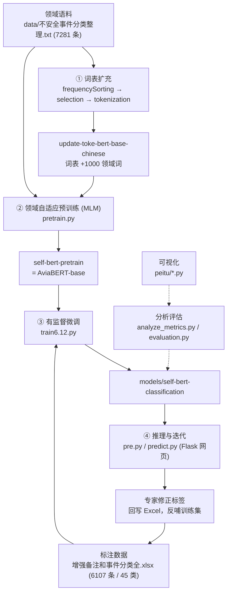

# Aviation-Bert · 航空告警事件分类识别

> 面向民航不安全事件报告的中文文本多分类系统。在 `bert-base-chinese` 基础上做**领域词表扩充**与**领域自适应预训练**，得到航空领域预训练模型 **AviaBERT**，再通过数据增强与类别加权缓解长尾分布问题。

<p>
  
  
  
  
</p>

---

## 目录

- [项目简介](#项目简介)
- [整体架构](#整体架构)
- [目录结构](#目录结构)
- [数据说明](#数据说明)
- [方法详解](#方法详解)
- [实验结果](#实验结果)
- [快速开始](#快速开始)
- [环境依赖](#环境依赖)
- [文件清单](#文件清单)
- [已知问题与后续计划](#已知问题与后续计划)

---

## 项目简介

民航安全管理部门每天会收到大量**不安全事件报告**，传统做法依赖人工阅读后归类，效率低且标注口径难以统一。本项目将这一流程自动化：输入一段事件描述文本，模型输出其所属的事件类别（共 45 类）。

与直接使用通用中文 BERT 相比，本项目的核心改进在于**让预训练模型"懂民航"**：

| 关键问题 | 本项目做法 |
| --- | --- |
| 领域术语（如"低云低能见""跑道积冰积雪"）不在通用词表中，被切碎成单字 | 基于领域语料统计高频词，向词表注入 1000 个航空领域词 |
| 通用语料的语义分布与告警文本差异大 | 用 7281 条领域语料做 MLM 继续预训练，得到 AviaBERT |
| 类别分布长尾，最大类 2768 条、最小类仅 1 条 | 数据增强 + 类别加权损失 + 小样本类别单独评估 |

---

## 整体架构

整个系统是一条串行的四阶段流水线，前一阶段的产物是后一阶段的输入：



**四个阶段对应的核心脚本：**

| 阶段 | 脚本 | 产出 |
| --- | --- | --- |
| ① 词表扩充 | `frequencySorting.py` → `selection.py` → `tokenization.py` | `pretrained-models/update-toke-bert-base-chinese` |
| ② 领域预训练 | `pretrain.py` | `pretrained-models/self-bert-pretrain` |
| ③ 有监督微调 | `train.py`（基础版）/ `train6.12.py`（含小样本评估，推荐） | `models/self-bert-classification` |
| ④ 推理与迭代 | `pre.py` / `predict.py` | Flask 分类页面 + 标签回写 |

**贯穿其间的分析与可视化：**

| 脚本 | 作用 |
| --- | --- |
| `analyze_metrics.py` | 逐类别 P/R/F1、混淆矩阵、类别分布、少数类专项指标 |
| `evaluation.py` | 解析 `trainer_state.json`，绘制指标 / 训练损失 / 验证损失趋势 |
| `peitu/tongji.py`、`tongji_longtail.py` | 领域词频长尾分布图 |
| `peitu/duibitu.py` | 六种模型配置的四项指标对比柱状图 |
| `peitu/losstu.py`、`shiyantu.py` | 训练损失曲线、整体指标曲线 |

---

## 目录结构

```
.
├── README.md                       # 本文件
├── requirements.txt                # 依赖清单
├── .gitignore
│
├── dataset.py                      # PyTorch Dataset：文本 → input_ids/attention_mask/labels
├── model.py                        # 加权损失模型（类别权重 CrossEntropyLoss）
│
├── frequencySorting.py             # ① jieba 分词 + 词频统计
├── selection.py                    # ① 取词频 Top-1000 → 简字简语-new.txt
├── tokenization.py                 # ① 扩充 BERT 词表并 resize_token_embeddings
├── pretrain.py                     # ② MLM 领域自适应预训练
├── train.py                        # ③ 微调（基础版，仅整体指标）
├── train6.12.py                    # ③ 微调（当前主用版，含小样本类别指标）
├── pre.py / predict.py             # ④ Flask 推理服务（predict.py 为 Windows 字体版）
│
├── analyze_metrics.py              # 逐类别评估 + 混淆矩阵
├── evaluation.py                   # 训练曲线绘制
├── import_to_excel.py              # 数据导入工具（txt → xlsx）
│
├── data/                           # 语料与标注数据
├── models/                         # 训练输出（已 gitignore）
├── pretrained-models/              # 预训练权重（已 gitignore）
├── output-yuanshi/                 # 训练过程指标 CSV 与图片
├── peitu/                          # 论文配图脚本与成品图
└── 相关操作文档/                    # 工作报告与训练手册
```

---

## 数据说明

### 标注数据集（`data/`）

| 文件 | 规模 | 说明 |
| --- | --- | --- |
| `增强备注和事件分类全.xlsx` | **6107 条 / 45 类** | 增强后的训练集，字段 `text` + `label`，脚本默认读取此文件 |
| `备注和事件分类全.xlsx` | 5478 条 | 原始标注集，未经增强 |
| `危险天气.xlsx` | 2766 条 | 危险天气类的专项数据 |
| `label_mapping.json` | 45 项 | 类别编号 → 类别名称映射，训练时自动生成 |
| `augmented/augmented_data.csv`、`augmented/combined_data.xlsx` | — | 数据增强产物 |

### 领域语料与词表

| 文件 | 规模 | 说明 |
| --- | --- | --- |
| `不安全事件分类整理.txt` | 7281 行 | MLM 预训练语料，同时用于词频统计 |
| `简字简语.txt` | 19635 行 | 民航领域候选词表 |
| `简字简语-new.txt` | 1000 行 | 词频筛选后实际注入 BERT 词表的领域词 |
| `frequency_results.txt` | 1500 行 | 各词频次统计结果（`Word: xxx, Frequency: n`） |
| `stopwords.txt` | 3076 行 | 停用词表 |
| `用语/` | — | 民航通话用语参考资料（MHT4014-2003 等） |

### 类别分布（长尾）

45 个类别中，样本数差异跨越三个数量级：

```
危险天气              2768  ████████████████████████████████████████
空中机械故障          1067  ███████████████
低云低能见             589  ████████
紧急事件通报：飞行中…… 237  ███
管制受限               145  ██
...
紧急事件通报：航空器爆炸物威胁      2  ▏
紧急事件通报：机上有可疑传染病病例   2  ▏
冲出/偏出跑道或跑道外接地           1  ▏
```

> 最大类与最小类样本量之比约 **2768 : 1**，这是本项目必须引入数据增强与类别加权的根本原因。

---

## 方法详解

### ① 词表扩充（Vocabulary Adaptation）

通用中文 BERT 的词表以通用语料为统计基础，民航术语往往被拆成无意义单字。做法分三步：

1. **`frequencySorting.py`** —— 用 `jieba` 对 7281 行领域语料分词，过滤单字与停用词，统计候选词表中每个词的出现频次，输出 `frequency_results.txt`。
2. **`selection.py`** —— 读取频次文件，取 Top-1000 高频领域词写入 `简字简语-new.txt`。
   > 选 1000 是频次长尾分布的拐点：第 1000 名附近频次已降至 7 左右，再往后收益递减。
3. **`tokenization.py`** —— 加载 `bert-base-chinese` 分词器，`add_tokens()` 逐个加入新词，`resize_token_embeddings()` 扩展模型嵌入矩阵，保存为 `update-toke-bert-base-chinese`。

### ② 领域自适应预训练（Domain-Adaptive Pretraining）

`pretrain.py` 在扩充词表后的模型上继续做 **MLM（掩码语言模型）** 训练：

- 语料：`不安全事件分类整理.txt`（按行切分为样本）
- 掩码比例：15%，`max_length=128`，padding 到定长
- 训练：20 epoch，batch size 16
- 自定义 `CustomTrainer` 重写 `training_step()`，按 epoch 记录 loss 供绘图
- 产出：`pretrained-models/self-bert-pretrain`，即 **AviaBERT-base**

此时模型尚未见过任何分类标签，只是完成了"语言习惯"的领域迁移。

### ③ 有监督微调（Fine-tuning）

`train6.12.py` 是当前主用版本，相较 `train.py` 的关键差异是**把长尾问题显式纳入训练与评估**：

1. **标签编码**：`LabelEncoder` 将 45 个类别映射为 0–44，并落盘 `label_mapping.json`（推理时反向查表）。
2. **分层切分**：构造 `SMALL_SAMPLE_CLASSES` 列表（24 个稀有类），对小样本与大样本数据**分别**按 8:2 切分后再合并 —— 避免随机切分导致稀有类在验证集中完全缺席。
3. **自定义 `CustomTrainer`**：重写 `evaluate()`，每个 epoch 记录整体与小样本两套 `accuracy / precision / recall / f1`，并捕获训练 loss。
4. **训练配置**：20 epoch，train/eval batch size 16，`evaluation_strategy="epoch"`，`save_total_limit=3`，最大序列长度 128。
5. **训练后处理**：`plot_overall_metrics()` 自动产出指标曲线 PNG + CSV 到 `output-yuanshi/`。

**类别加权（`model.py`）**：`WeightedBertForSequenceClassification` 在损失函数中注入类别权重：

```python
self.loss_fct = nn.CrossEntropyLoss(weight=self.class_weights)
```

需要说明的是，当前实现是在 `super().forward()` 已返回标量 loss 之后再次调用 `loss_fct`，等价于"对已归约的损失二次计算"，其数值语义与设计意图不一致（详见[已知问题](#已知问题与后续计划)）。若要做严肃的加权训练，建议改为直接对 `outputs.logits` 施加加权 CrossEntropyLoss。

### ④ 推理与人工闭环

`pre.py` / `predict.py` 提供一个 Flask 网页（`0.0.0.0:5000`）：

- 输入告警文本 → 模型给出 **Top-5 类别及概率**，并以柱状图（base64 内联）展示；
- 若模型判断有误，使用者可从 45 个类别中**手动选择正确标签**，结果追加写回 `data/备注和事件分类全.xlsx`；
- 页面提供"下载历史数据"接口。

这构成了一个**人在回路（Human-in-the-loop）**的迭代闭环：模型预测 → 专家修正 → 数据回流 → 重新训练。`predict.py` 是 `pre.py` 的 Windows 适配版（字体改为 `SimHei / Microsoft YaHei`，去除 Linux 字体硬编码路径）。

---

## 实验结果

`peitu/duibitu.py` 记录了六种模型配置在同一测试集上的四项指标：

| 模型配置 | Accuracy | Precision | Recall | F1 |
| --- | ---: | ---: | ---: | ---: |
| BERT-base-Chinese（通用，未适配） | 0.0510 | 0.0330 | 0.0521 | 0.0404 |
| + 词表扩充 | 0.2840 | 0.1850 | 0.2910 | 0.2215 |
| AviaBERT-base（词表扩充 + 领域预训练） | 0.5010 | 0.3330 | 0.5115 | 0.4036 |
| AviaBERT-base + 数据增强 | 0.8636 | 0.8059 | 0.8626 | 0.8333 |
| AviaBERT-base + 加权损失 | 0.5218 | 0.3905 | 0.5175 | 0.4451 |
| **AviaBERT（完整方案）** | **0.9028** | **0.8162** | **0.8966** | **0.8543** |

**结论：**

1. **领域适配是最大变量。** 通用 BERT 直接微调几乎不可用（Accuracy 5.1%，接近 45 分类的随机水平 2.2% 之上的微弱起点），词表扩充将其提升到 28.4%，再叠加领域预训练达到 50.1% —— 说明"让模型先读懂民航语言"比调分类头更关键。
2. **数据增强是第二增长点。** 在 AviaBERT-base 上引入增强数据后 Accuracy 从 50.1% 跃升至 86.4%，F1 从 0.404 提升到 0.833，是流水线中增益最大的一步。
3. **加权损失单独使用收益有限**（Accuracy 52.2%），说明在不平衡场景下"造数据"比"调权重"更有效。
4. **完整方案达到 Accuracy 90.3% / F1 0.854**，相对通用 BERT 基线提升约 18 倍。

> 复现对比图：`python peitu/duibitu.py` → 输出 `model_metrics_comparison.png` / `.pdf`（600 dpi）

训练过程曲线见 `output-yuanshi/`：`self-bert_overall_metrics.csv`、`self-bert_training_loss.csv`、`self-bert_small_sample_metrics.csv` 及对应 PNG。

---

## 快速开始

### 1. 环境准备

```bash
conda create -n aviation-bert python=3.10 -y
conda activate aviation-bert
pip install -r requirements.txt
```

### 2. 准备预训练权重

`pretrained-models/` 与 `models/` 体积超过 7 GB，**未纳入版本库**，需自行生成：

```bash
# 从 HuggingFace 下载 bert-base-chinese 放入 pretrained-models/bert-base-chinese
# 然后依次执行流水线
python frequencySorting.py     # 词频统计 → data/frequency_results.txt
python selection.py            # 取 Top-1000 → data/简字简语-new.txt
python tokenization.py         # 扩充词表 → pretrained-models/update-toke-bert-base-chinese
python pretrain.py             # MLM 领域预训练 → pretrained-models/self-bert-pretrain
python train6.12.py            # 微调 → models/self-bert-classification
```

### 3. 启动分类服务

```bash
python predict.py              # Windows
# 或 python pre.py             # Linux（需调整字体路径）
# 浏览器访问 http://localhost:5000
```

### 4. 评估与绘图

```bash
python analyze_metrics.py self-bert checkpoint-4500   # 逐类别指标 + 混淆矩阵
python evaluation.py                                  # 训练曲线
python peitu/duibitu.py                               # 模型对比图
```

---

## 环境依赖

`requirements.txt`：

```
tqdm==4.66.1
transformers==4.37.2
torch==2.1.2
```

此外代码中实际用到但未写入清单的包：

| 包 | 用途 |
| --- | --- |
| `pandas` / `openpyxl` | 读取与写回 Excel 数据集 |
| `scikit-learn` | `LabelEncoder`、分层切分、P/R/F1 计算 |
| `matplotlib` / `seaborn` | 指标曲线、混淆矩阵、类别分布图 |
| `jieba` | 领域语料分词与词频统计 |
| `datasets` | MLM 预训练语料加载 |
| `modelscope` | 备选模型的下载渠道 |
| `flask` | 推理 Web 服务 |

> 建议将上述依赖一并补入 `requirements.txt` 以保证环境可复现。

---

## 文件清单

### 核心脚本

| 文件 | 行数级 | 职责 |
| --- | --- | --- |
| `train6.12.py` | ~300 | 微调主脚本：分层切分 + 小样本指标 + 训练曲线 |
| `train.py` | ~194 | 微调基础版 |
| `pretrain.py` | ~68 | MLM 领域自适应预训练 |
| `tokenization.py` | ~30 | 词表扩充 |
| `pre.py` / `predict.py` | ~240 | Flask 推理服务与人在回路标注 |
| `analyze_metrics.py` | ~230 | 逐类别评估、混淆矩阵、长尾分析 |
| `evaluation.py` | ~100 | 训练日志解析与曲线绘制 |
| `model.py` | ~15 | 加权损失模型定义 |
| `dataset.py` | ~30 | Dataset 封装 |
| `frequencySorting.py` | ~32 | 词频统计 |
| `selection.py` | ~10 | Top-1000 词筛选 |
| `import_to_excel.py` | ~30 | 数据导入工具 |

### 项目阶段产物

| 路径 | 内容 |
| --- | --- |
| `pretrained-models/update-toke-bert-base-chinese/` | 扩充词表后的 BERT |
| `pretrained-models/self-bert-pretrain/` | AviaBERT-base（领域预训练产物） |
| `models/self-bert-classification/` | 微调后的分类模型 |
| `output-yuanshi/` | 逐 epoch 指标 CSV 与图表 |
| `peitu/` | 论文配图脚本（5 个）与成品图 |
| `相关操作文档/` | 系统工作报告、训练操作手册 |

---

## 已知问题与后续计划

- **加权损失的实现需修正。** `model.py` 中 `loss_fct` 被施加于已归约的标量 loss，语义不正确；建议改为对 `outputs.logits` 与 `labels` 直接计算加权交叉熵。
- **标签体系存在重复。** `label_mapping.json` 中部分类别仅因空格或尾句号不同被拆成两个标签（如 `…0至30 分钟…` 与 `…0至30分钟…`、`…爆炸物威胁` 与 `…爆炸物威胁  `），建议先做标签归一化，可减少无效类别并提升稀有类样本量。
- **`train6.12 - 副本.py` 与 `train6.12.py` 内容完全相同**，属于冗余副本，可删除。
- **`import_to_excel.py` 中硬编码了本机绝对路径**（`C://Users//25497//Desktop//论文初稿//…`），迁移到其他机器会直接失败，建议改为命令行参数。
- **`analyze_metrics.py` 默认分词器路径**指向 `pretrained-models/dienstag/chinese-macbert-base`，与微调时实际使用的 `update-toke-bert-base-chinese` 不一致，容易在评估阶段引入隐性偏差。
- **类别不平衡尚未根治。** 仍有多个类别样本量在个位数，建议补充：Focal Loss、类别平衡采样（如 `WeightedRandomSampler`）、少样本提示学习或 LLM 辅助生成增强样本。
- **依赖清单不完整**，见[环境依赖](#环境依赖)。

---

## 引用

本项目为民航告警事件分类识别系统的研究实现。若使用其中的模型或数据，请注明来源。

## 许可

仅供学术研究与教学使用。数据集涉及民航运行安全信息，请遵循相关保密规定，勿用于商业用途或对外传播。
